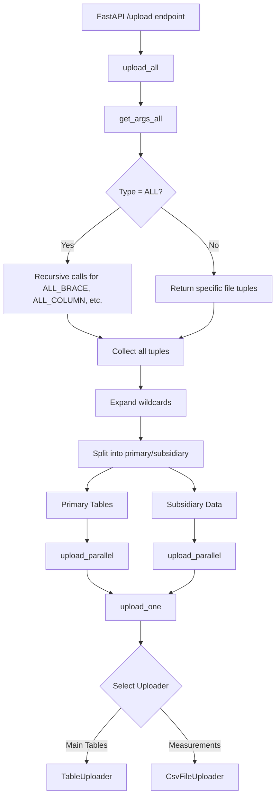
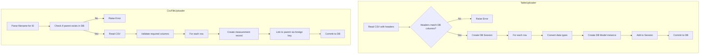

# Flow of uploader.py mermaid

```mermaid
flowchart TD
    A[FastAPI /upload endpoint] --> B[upload_all]
    B --> C[get_args_all]

    C --> D{Type = ALL?}
    D -->|Yes| E[Recursive calls for ALL_BRACE, ALL_COLUMN, etc.]
    D -->|No| F[Return specific file tuples]
    E --> G[Collect all tuples]
    F --> G

    G --> H[Expand wildcards]
    H --> I[Split into primary/subsidiary]

    I --> J[Primary Tables]
    I --> K[Subsidiary Data]

    J --> L[upload_parallel]
    K --> M[upload_parallel]

    L --> N[upload_one]
    M --> N

    N --> O{Select Uploader}
    O -->|Main Tables| P[TableUploader]
    O -->|Measurements| Q[CsvFileUploader]
```
# Flow of uploader.py TableUploader mermaid

```mermaid
flowchart TD
    subgraph TableUploader
        T1[Read CSV with headers] --> T2{Headers match DB columns?}
        T2 -->|No| T3[Raise Error]
        T2 -->|Yes| T4[Create DB Session]
        T4 --> T5[For each row]
        T5 --> T6[Convert data types]
        T6 --> T7[Create DB Model instance]
        T7 --> T8[Add to Session]
        T8 --> T9[Commit to DB]
    end

    subgraph CsvFileUploader
        C1[Parse filename for ID] --> C2[Check if parent exists in DB]
        C2 -->|No| C3[Raise Error]
        C2 -->|Yes| C4[Read CSV]
        C4 --> C5[Validate required columns]
        C5 --> C6[For each row]
        C6 --> C7[Create measurement record]
        C7 --> C8[Link to parent via foreign key]
        C8 --> C9[Commit to DB]
    end
```
